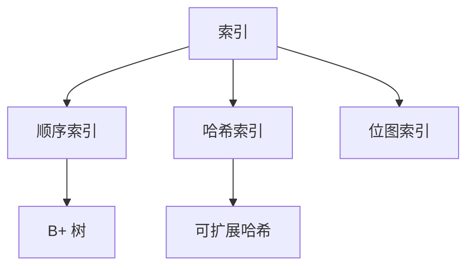
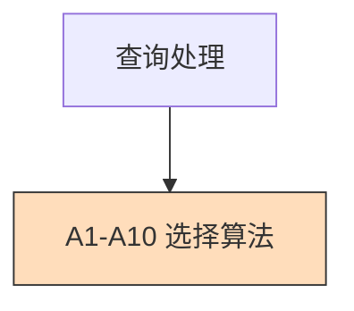

# Chapter Note Template

The standard shape for one chapter of a study-notes vault. Adapt section count and depth to the chapter, but keep the spine intact.

---

## Spine

Every chapter file has these eight parts in order. Skipping any of them produces a noticeably worse note.

1. **Frontmatter** (YAML)
2. **`> [!abstract] 一句话概括`** — single sentence stating the chapter's purpose
3. **章导图** (chapter-level Mermaid topology) — what concepts live in this chapter and how they relate
4. **Body sections** — one per major topic
5. **整章一图汇总 / 全章一图汇总** — second Mermaid summary at the end
6. **必背速查 / 应试速查表** — terse fact table
7. **必练例题** — at least 2-3 worked examples with full solutions
8. **易错与考点** — gotchas, traps, common confusions

---

## Frontmatter

```yaml
---
title: <Chapter Title in user's primary language>
chapter: <Chapter number from source, e.g. "Chp 14" or "第 3 章">
pdf_ref: <source_file_1.pdf>, <source_file_2.pdf>
tags:
  - <broad-domain-tag>          # e.g. 数据库, machine-learning, networking
  - <chapter-topic-1>            # e.g. B+树
  - <chapter-topic-2>
prev: "[[<previous-chapter-file>]]"
next: "[[<next-chapter-file>]]"
---
```

The `pdf_ref` field is essential — it lets the reader trace any concept back to the original slide for self-verification.

---

## Section anatomy

Each body section follows this micro-pattern:

```markdown
## <number>.<sub> <Section title> ★🔥

### Definition / Statement

A clear, prose definition. If formal: present the formula or theorem in a math block, then explain it in plain language.

### Example / Walkthrough

A worked example with concrete numbers or values. For algorithms: trace the algorithm step-by-step on a small input.

### Why / Intuition

Explain why this concept exists, what problem it solves, and how it connects to surrounding concepts. This is what makes notes durable.

### Variants / Edge cases (if relevant)

Bullet the edge cases. Each one with a one-liner.
```

★ marks **must-know**. 🔥 marks **high-frequency exam target**. Use sparingly so they keep meaning.

---

## Mermaid usage in chapters

The chapter导图 (top of file) gives readers the topology before they dive in. Aim for 5-12 nodes, max two levels deep. Examples:



The 全章一图汇总 (bottom of file) recaps with full coverage. Include all sub-topics, color-code with `style` for hot areas:



---

## Tables for "对比" content

Whenever the source has "compare A vs B" content, use a table. Tables are the most exam-friendly format.

```markdown
| 维度 | A | B |
| --- | --- | --- |
| 时间复杂度 | O(n) | O(log n) |
| 空间 | 大 | 小 |
| 适用场景 | … | … |
```

---

## Worked examples

For algorithm chapters: **show the trace, not just the algorithm**. Example for B+-tree insertion:

```markdown
> [!example] 插入 'Adams' 到叶节点 [Brandt, Califieri, Crick]
>
> 步骤 1：4 个 key 排序：[Adams, Brandt, Califieri, Crick]
> 步骤 2：前 ⌈3/2⌉ = 2 个留原节点：[Adams, Brandt]
> 步骤 3：后 2 个进新节点：[Califieri, Crick]
> 步骤 4：把 (Califieri, 新节点指针) 提升到父节点
```

For computation chapters: **show the arithmetic**. Don't say "the cost formula gives…" — write out the formula, plug in numbers, get an answer.

---

## Bilingual handling

If the source is bilingual (Chinese course with English technical terms is the common case), keep both:

```markdown
| **Atomicity 原子性** | 要么都做，要么都不做 |
```

Term first, translation second, separated by a space. In headings, prefer the user's primary language with the technical term in parens:

```markdown
## 7.4 函数依赖（Functional Dependency, FD）★🔥
```

---

## Common pitfalls in chapter writing

- **Bullets that mirror slide bullets one-to-one.** That's a transcript, not notes. Restructure into prose + tables.
- **Section headings that don't say what's inside.** "其他考虑" is not a heading; "缓冲管理 — 三种替换策略" is.
- **Theorems without proofs/intuition.** Even one sentence of "this works because…" goes a long way.
- **Algorithms without trace.** Pseudocode alone is not enough — students need to see the algorithm execute.
- **Missing 必练例题 section.** Without worked problems the chapter is unfinished.
- **Skipping 易错与考点.** This is where exam scores are won or lost.
