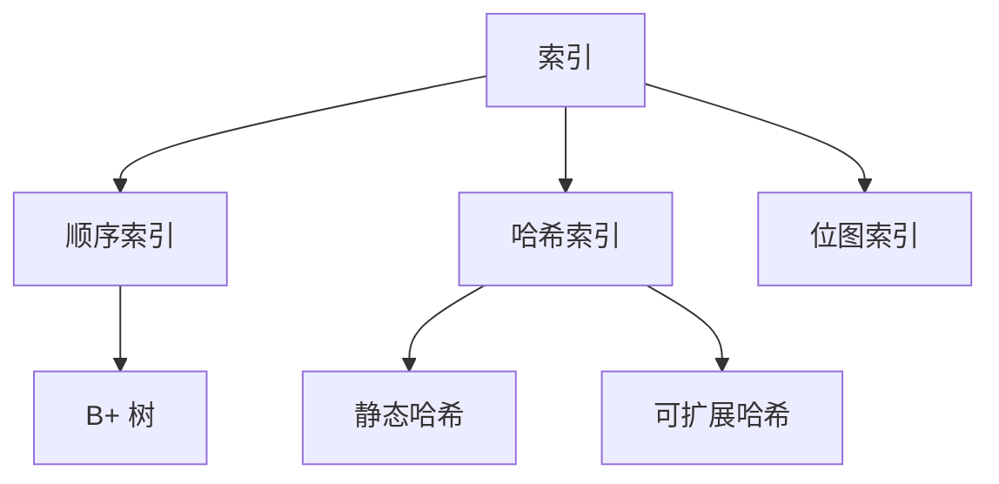
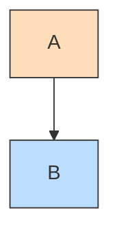
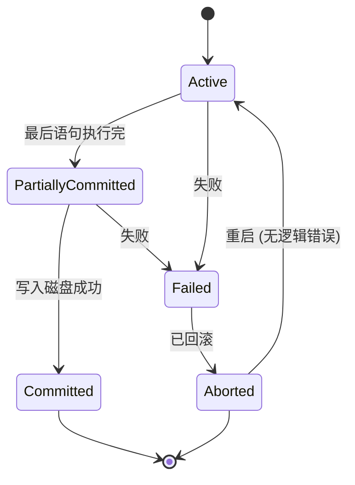
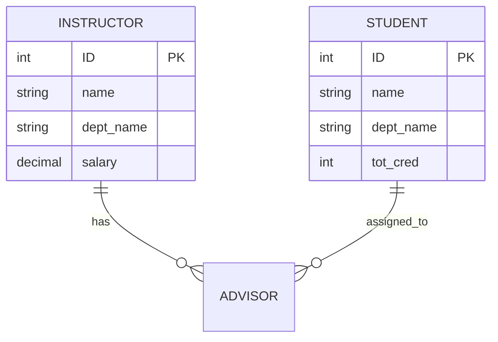
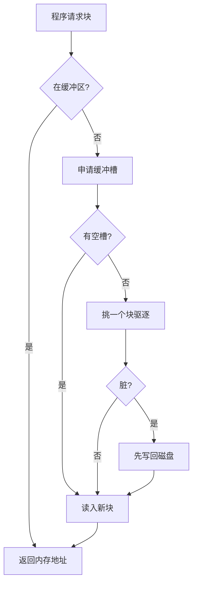
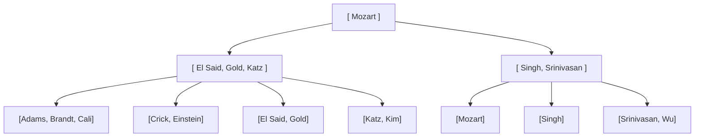
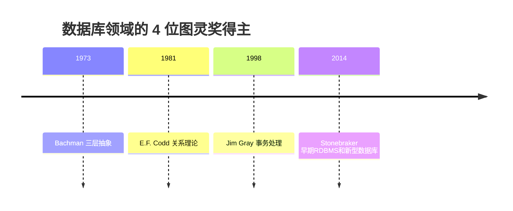
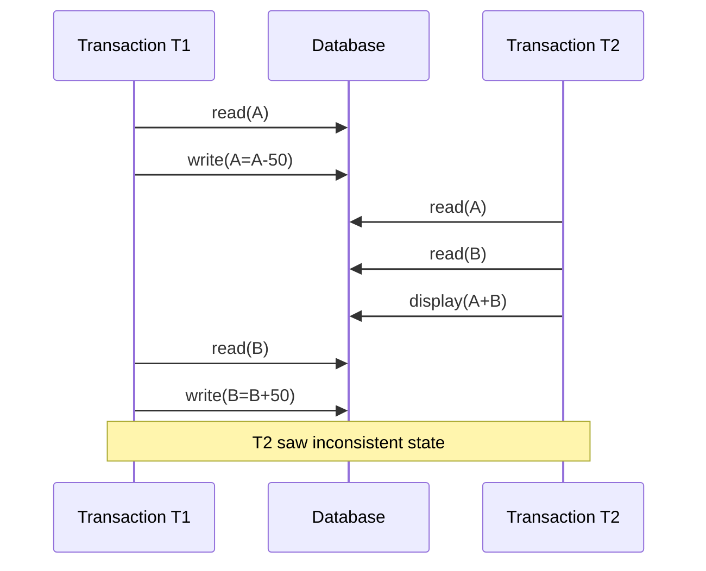
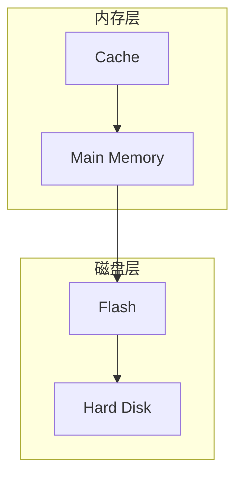

# Mermaid Cookbook for Study Notes

Patterns for the visual content slide-text-extraction loses. When a chapter mentions a concept that the source slides clearly drew but the text dump lost, find the relevant pattern here.

---

## 1. Concept topology — `graph TB` / `graph LR`

For "what's in this chapter" (top-of-file 章导图) or "how do these concepts relate":

`TB` = top-to-bottom, `LR` = left-to-right. Use `LR` for course roadmaps (chapters left to right), `TB` for hierarchies.

To color-code:

Common color palette:
- `#fdb` (peach) — "key/hot" topics
- `#bdf` (sky) — "data/storage"
- `#dfd` (mint) — "results/outputs"
- `#fed` (cream) — "memory/cache"
- `#ddd` (gray) — "background/old"

---

## 2. State machines — `stateDiagram-v2`

For transaction states, protocol states, lifecycle diagrams:

`[*]` is the start/end. Labels go after `:`. State names with spaces need camelCase or quotes.

---

## 3. ER diagrams — `erDiagram`

For database schemas, conceptual data models:

Cardinality syntax:
- `||--||` one-to-one
- `||--o{` one-to-many
- `}o--o{` many-to-many
- `}o--||` many-to-one

`PK` = primary key, `FK` = foreign key, `UK` = unique key.

---

## 4. Algorithm flowcharts — `flowchart`

For algorithm decision trees, control flow:

`{}` = decision diamond, `[]` = process box, `()` = rounded.

---

## 5. Tree structures (B+-trees, ASTs, family trees)

Mermaid doesn't have a native tree diagram type, so use `graph TB` with manual layout:

For B+-trees specifically: use `[brackets]` for the key list inside each node. Quote the labels to keep brackets literal.

---

## 6. Timelines — `timeline`

For history of standards, list of contributors, evolution of a field:

Each line is `<event> : <description>`. No commas in descriptions (or quote them).

---

## 7. Sequence diagrams — `sequenceDiagram`

For concurrency schedules, network protocols, distributed systems messages:

`->>` = solid arrow, `-->>` = dashed (response), `Note over X,Y` = annotation.

---

## 8. Subgraphs (clustering related nodes)

For grouping related concepts inside a larger diagram:

The `subgraph X[Label]` syntax gives the cluster a label. Use to make 3-tier architecture diagrams (presentation/business/data) and similar.

---

## When NOT to use Mermaid

- **Simple 2-3 item comparisons** — use a table.
- **Linear sequences without branching** — use a numbered list.
- **Lookup tables** — use a Markdown table.
- **Source code** — use a fenced code block.

A diagram should add information density, not replace text. If a sentence does the job, don't draw it.

---

## Common Mermaid mistakes

- **Special characters in node labels** — wrap labels with `[]` and use HTML entities or quotes for `<`, `>`, etc.
  Bad: `A[salary > 50000]` → "syntax error"
  Good: `A["salary > 50000"]`
- **Forgetting to quote strings with spaces** in `stateDiagram-v2`.
- **Too many nodes**. Past ~20 nodes Mermaid renders poorly. Split into multiple diagrams.
- **Cyclic graphs without `graph TD`/`graph LR`**. Use `graph` (not `flowchart`) for general graphs to avoid auto-layout fights.
- **Mixing Mermaid types in one block.** A `graph` block can't contain `stateDiagram` syntax.
