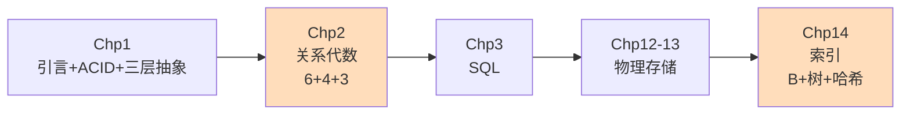

# Master Overview Template (00-...md)

The 00- file is the front door of the entire vault. Everything else hangs off it. Get this right and the rest of the vault is navigable.

---

## Spine

1. **Frontmatter** (course-level metadata)
2. **Title + tagline** — the course in one sentence
3. **使用方式 / How to use these notes** — a `> [!info]` callout explaining the conventions
4. **课程脉络 / Course map** — table mapping topics to chapters to files
5. **复习路线图 / Roadmap** — Mermaid `graph LR` showing recommended reading order
6. **最重要的几个概念 / Hall of fame** — the 3-5 facts so important they should appear in the overview itself (e.g., "ACID", "the 4 Turing awards", "the big triangle of DBMS architecture")
7. **快速速查 / Quick reference** — tables of high-yield facts
8. **期末考试速复习清单 / Final-exam revision checklist** — checkbox list of items to drill
9. **完整笔记目录 / Full TOC** — table of every file with one-line description
10. **推荐复习顺序 / Suggested study order** — how to use the vault

---

## Frontmatter

```yaml
---
title: <Course Name>复习总览
course: <course-id> <course-name>
semester: <e.g. 2026春>
teacher: <instructor name + institution>
tags:
  - <subject-domain>
  - 复习
  - 索引页
created: <YYYY-MM-DD>
---
```

---

## "使用方式" callout

Spell out the conventions used throughout the vault:

```markdown
> [!info] 本笔记的使用方式
> - 每一章对应一份独立笔记，已用 [[wikilinks]] 互相串联。
> - **重点（★）** 与 **常考（🔥）** 标识用于快速定位考点。
> - 凡涉及"对比"的内容（如稀疏 vs 稠密、嵌套循环 vs 哈希连接），尽量画成表格。
> - 章末附"必练例题"和"易错与考点"清单，最后一晚速读即可回忆全章。
```

---

## 复习路线图 (Mermaid)

A linear `graph LR` showing the chapter order with the most important topic per chapter:



Highlight the chapters that are most exam-heavy with `style fill:#fdb`.

---

## Hall of fame section

Pick 3-5 things so foundational that the student should be able to default-recite them. Examples for a databases course:

- ACID (with one sentence each)
- The 4 Turing awards in databases
- The DBMS big triangle (query processor / storage manager / disk)
- The 4 isolation levels

These should be in the overview itself, not just linked. The student should be able to read the overview file alone and have the spine of the course in their head.

---

## Quick reference tables

Cherry-pick high-yield tables from across the chapters and put copies in the overview. These should be the tables you'd want on a one-page cheat sheet:

```markdown
| 隔离级别 | 脏读 | 不可重复读 | 幻读 |
| --- | :---: | :---: | :---: |
| Read Uncommitted | ✓ | ✓ | ✓ |
| Read Committed | ✗ | ✓ | ✓ |
| Repeatable Read | ✗ | ✗ | ✓ |
| Serializable | ✗ | ✗ | ✗ |
```

---

## 期末考试速复习清单

A checkbox list of the highest-value drill targets, each with a wikilink:

```markdown
- [ ] [[02-关系模型与关系代数#6 个基本运算]] 含义 + 符号
- [ ] [[05-索引(B+树与哈希)#B 树插入分裂规则]] 与删除合并/重分布
- [ ] [[06-查询处理#5 种连接算法]] 代价对比
```

---

## 完整笔记目录 (TOC)

A table of every file with one-line description:

```markdown
| 文件 | 章节 | 内容 |
| --- | --- | --- |
| [[01-引言与基础概念]] | Chp 1 | DBMS、三层抽象、ACID 预告、图灵奖 |
| [[02-关系模型与关系代数]] | Chp 2 | 关系/键、6+4+3 运算、TRC/DRC |
| ... | ... | ... |
```

---

## 推荐复习顺序

End with concrete advice on how to use the vault:

```markdown
1. **第一遍精读**（按课程主线）：[[01-...]] → [[NN-...]]
2. **第二遍刷题**：[[(NN+1)-练习题与解答]]
3. **第三遍速记**：本笔记的"必背要点"汇总
```

---

## What makes the overview good

- **Self-contained**: a student reading just the 00- file should know the spine of the course.
- **Navigable**: every chapter is linked, every important concept is anchored.
- **Pre-loaded with the highest-yield facts**: the student shouldn't have to dig.
- **Visual**: the Mermaid roadmap is essential. A vault without a roadmap feels like a maze.
